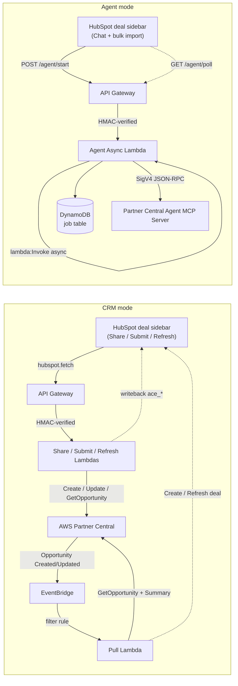

# HubSpot ↔ AWS Partner Central Integration

> Two AWS-Partner-Central integrations for HubSpot deal records, in one repo. Pick what you need — they're independent and deploy with a single command.

[](#prerequisites) [](#prerequisites) [](LICENSE)

---

## Start here

| I want to… | Go to |
|---|---|
| Follow a **guided workshop** (CRM card + optional Agent add-on) | [`docs/workshop.md`](docs/workshop.md) — ~90 min |
| Deploy **only the Agent chat card** | [`docs/workshop-agent.md`](docs/workshop-agent.md) — ~30-45 min |
| **Deploy on my own** without a workshop guide | [Quick deploy](#quick-deploy) below |
| **Customise** the field mapping, stages, or card UI | [Customisation points](#customisation-points) below |
| Understand the architecture or troubleshoot | [`docs/architecture.md`](docs/architecture.md) |

---

## What this is

Two HubSpot UI Extensions backed by AWS Lambda, both targeting the AWS Partner Central API:

| Component | What it does | What you'll see |
|---|---|---|
| **CRM card** (Share / Submit / Refresh) | Creates, updates, and reads AWS Partner Central opportunities from HubSpot deal fields. 20+ fields round-trip bidirectionally. A Pull Lambda subscribes to AWS EventBridge and reverse-syncs every AWS-side change back to HubSpot automatically. | Three buttons appear on the deal record sidebar. **Share** creates an opportunity in AWS Partner Central. **Submit** formally submits it for AWS review. **Refresh** pulls the latest AWS status back to the deal. A success toast confirms each action; `ace_opportunity_id`, `ace_sync_status`, and `ace_last_sync` update on the deal. |
| **Agent card** (Conversational AI) | A chat panel on the deal record talking to AWS's Partner Central Agent MCP Server — pipeline insights, funding eligibility, opportunity progression — with human-in-the-loop approval for every write. Includes a paste-and-go bulk-import panel for batched opportunity creation. | A chat composer on the deal record. Type a question ("What's the funding eligibility for this deal?") and the agent responds using live Partner Central data. Write operations surface an inline Approve / Reject panel before anything changes in AWS. |

The two components are independent: deploy one, the other, or both. They share an AWS account and a HubSpot portal. Nothing else.

---

## Customisation points

Most customisations require no code changes — only a secret update and a Lambda bounce. Code changes are isolated to one file each.

| What to change | Where | How |
|---|---|---|
| **HubSpot pipeline stage → AWS stage mapping** | `STAGE_MAPPING` secret | Semicolon-delimited `hubspot_stage_id=aws_stage` pairs. Set via `./infra/set-secrets.sh STAGE_MAPPING`. No code change. |
| **Stage labels shown in toasts** | `STAGE_DISPLAY_NAMES` secret | Same format as `STAGE_MAPPING`. Set via `./infra/set-secrets.sh STAGE_DISPLAY_NAMES`. No code change. |
| **Which deal fields sync to AWS** | `backend/lib/payload.ts` | Edit `buildCreatePayload` and `buildUpdatePayload`. Each function maps HubSpot deal properties to the ACE API request shape. |
| **HubSpot custom properties added to deals** | `src/hubspot_client.py` + `scripts/setup_ace_*.py` | Add or remove property definitions, then re-run `./scripts/setup-hubspot-properties.sh` to provision them in HubSpot. |
| **Agent catalog (Sandbox vs. production AWS)** | `ACE_AGENT_CATALOG` secret | `"Sandbox"` (default) or `"AWS"`. Set via `./agent-infra/set-secrets.sh ACE_AGENT_CATALOG`. Also swap the IAM policy in `agent-infra/cloudformation.yaml` from `AWSPartnerCentralSandboxFullAccess` to `AWSPartnerCentralFullAccess`. |
| **CRM card UI** (button labels, layout, states) | `hubspot-card/src/app/cards/AceShareCard.tsx` | React component. Redeploy with `cd hubspot-card && hs project upload`. |
| **Agent card UI** (chat panel, bulk import) | `agent-card/src/app/cards/AgentCard.tsx` + `BulkImportPanel.tsx` | React components. Redeploy with `cd agent-card && hs project upload`. |
| **AWS region** | `ACE_REGION` secret or `export AWS_REGION=...` before deploy | Set via `./infra/set-secrets.sh ACE_REGION` for the CRM stack. |
| **Multi-environment isolation** (dev + prod in one account) | `--env-suffix <name>` flag on all deploy scripts | Appends `<name>` to every AWS resource name (stack, Lambdas, IAM role, log groups, secrets, DynamoDB tables). |

---

## Three deployment modes

```
┌──────────────────────────────────┬─────────────────────────────────┐
│  Mode                            │  What gets deployed             │
├──────────────────────────────────┼─────────────────────────────────┤
│  --mode crm                      │  CRM card + 4 lambdas:          │
│  (CRM only)                      │    Share, Submit, Refresh, Pull │
│                                  │  + EventBridge auto-pull rule   │
│                                  │  + DynamoDB pull-lock table     │
│                                  │  + Secrets Manager (CRM)        │
│                                  │                                 │
│  --mode agent                    │  Agent card + 2 lambdas:        │
│  (Agent only)                    │    Agent (sync, legacy /agent)  │
│                                  │    AgentAsync (start/poll/      │
│                                  │      worker — primary path)     │
│                                  │  + DynamoDB job table           │
│                                  │  + Secrets Manager (Agent)      │
│                                  │                                 │
│  --mode crm-and-agent            │  Everything above. Two separate │
│  (Both)                          │  CloudFormation stacks; you can │
│                                  │  redeploy either independently. │
└──────────────────────────────────┴─────────────────────────────────┘
```

Cost is roughly **$0.45/month** for the CRM stack (Secrets Manager dominates), similar for the Agent stack.

---

## Quick deploy

Plan ~90 minutes for the CRM mode, ~30-45 minutes for Agent only. The guided step-by-step is in [`docs/workshop.md`](docs/workshop.md) — the commands below are the short version for experienced deployers.

```bash
git clone <this-repo> hubspot-crm-pcagent-integration
cd hubspot-crm-pcagent-integration

# Install dependencies for the components you'll deploy.
# (Skip directories you don't need.)
cd backend       && npm ci && cd ..    # CRM lambdas
cd hubspot-card  && npm ci && cd ..    # CRM card
cd agent-backend && npm ci && cd ..    # Agent lambda
cd agent-card    && npm ci && cd ..    # Agent card
python3 -m venv .venv && source .venv/bin/activate
pip install -e ".[dev]"                # HubSpot provisioning CLI

# Pick your AWS profile / region (both optional).
export AWS_PROFILE=my-partner-profile
export AWS_REGION=us-east-1

# Deploy. Pick exactly one --mode.
./infra/unified-deploy.sh --mode crm                # CRM only
./infra/unified-deploy.sh --mode agent              # Agent only
./infra/unified-deploy.sh --mode crm-and-agent      # Both

# Sharing an AWS account with another deployment? Add --env-suffix
# to keep dev/prod resources separate (see docs/architecture.md):
# ./infra/unified-deploy.sh --mode crm-and-agent --env-suffix dev
```

After the deploy completes, the script tells you the next steps for each stack.

---

## Architecture



**Why the Agent path is async**: API Gateway HTTP APIs cap at 30 s. MCP `sendMessage` regularly takes 25-40 s for tool-call approvals. The async Lambda returns a `jobId` in <100 ms, kicks off a worker invocation that runs untethered from API Gateway with a 5-minute budget, and the card polls a cheap DynamoDB read until the worker writes the result. See [`docs/architecture.md`](docs/architecture.md) for the full design.

---

## Repository layout

| Directory | What it is | Used by mode |
|---|---|---|
| `backend/` | Node 22 Lambda code: Share / Submit / Refresh / Pull. | CRM |
| `hubspot-card/` | React UI Extension: Share / Submit / Refresh card. | CRM |
| `infra/` | CloudFormation + bash deploy for the CRM stack. | CRM |
| `agent-backend/` | Node 22 Lambda code: Agent (sync `/agent`) + Agent-Async (`/agent/start`, `/agent/poll`, self-invoked worker). | Agent |
| `agent-card/` | React UI Extension: chat card + bulk-import panel. | Agent |
| `agent-infra/` | CloudFormation + bash deploy for the Agent stack (2 Lambdas + DynamoDB job table). | Agent |
| `src/` | Python provisioning CLI: HubSpot custom property setup. | CRM |
| `scripts/` | One-time setup scripts (HubSpot picklists, AWS Products catalog seeding). | CRM |
| `docs/` | Architecture deep-dive, operations runbook, troubleshooting, workshop guides. | Both |
| `tests/` | Provisioning-CLI unit tests. | CRM |

---

## Documentation

- **[`docs/workshop.md`](docs/workshop.md)** — guided 90-minute walkthrough: fresh laptop → working CRM integration (Share / Submit / Refresh) on a HubSpot test account, including AWS Partner Central sandbox setup and AWS CLI install for macOS + Windows. Module 14 is an optional add-on layering the Agent card on top of the same setup (~25 min extra). Partners deploying outside the workshop format follow the same steps.
- **[`docs/workshop-agent.md`](docs/workshop-agent.md)** — Agent-only walkthrough (~30-45 min): chat card on the deal record, no CRM sync setup. Use this if you want only the conversational AI experience and don't need the Share / Submit / Refresh buttons.
- **[`docs/architecture.md`](docs/architecture.md)** — component diagram, request flows, design decisions, day-2 operations, and the verbatim-error catalogue.
- **[`backend/README.md`](backend/README.md)** — CRM backend internals (handler ↔ core contract, payload mapping).
- **[`infra/README.md`](infra/README.md)** — CRM stack deploy + ops reference.
- **[`hubspot-card/README.md`](hubspot-card/README.md)** — Share/Submit/Refresh card layout and state machine.
- **[`agent-backend/README.md`](agent-backend/README.md)** — Agent backend internals (sync vs async dispatcher, job store, MCP client).
- **[`agent-infra/README.md`](agent-infra/README.md)** — Agent stack deploy + ops reference.
- **[`agent-card/README.md`](agent-card/README.md)** — Chat card + bulk-import panel internals.
- **[`CONTRIBUTING.md`](CONTRIBUTING.md)** — local dev setup, testing, coding standards.

---

## Prerequisites

- **AWS account** with permission to create CloudFormation stacks, Lambda functions, an HTTP API Gateway, IAM roles, Secrets Manager secrets, DynamoDB tables (one per mode: pull-lock for CRM, job table for Agent), and an EventBridge rule (CRM mode only).
- **AWS Partner Network membership** with AWS Partner Central API access. Sandbox catalog is enough for development; production requires the AWS catalog.
- **HubSpot account** (any plan) with permission to install Private Apps and upload UI Extensions.
- **HubSpot Private App** with the scopes listed in [`docs/workshop.md`](docs/workshop.md#5-create-a-hubspot-private-app).
- Local CLI: AWS CLI ≥ 2.15, Node 22 + npm (HubSpot CLI requires Node 22; Lambda bundles target `nodejs20.x`), Python 3.11+ + pip (CRM mode only), HubSpot CLI (`@hubspot/cli`), `zip`, `shasum`.

---

## Teardown

To remove all AWS resources created by this project (useful after a workshop or when cleaning up a test account):

```bash
REGION="${AWS_REGION:-us-east-1}"

# 1. Delete the CloudFormation stacks
aws cloudformation delete-stack --stack-name ace-share-refresh --region "${REGION}"
aws cloudformation delete-stack --stack-name ace-agent           --region "${REGION}"
aws cloudformation wait stack-delete-complete --stack-name ace-share-refresh --region "${REGION}"
aws cloudformation wait stack-delete-complete --stack-name ace-agent           --region "${REGION}"

# 2. Delete the artifact S3 buckets (deploy.sh creates one per stack)
ACCOUNT=$(aws sts get-caller-identity --query Account --output text)
for bucket in "ace-share-refresh-deploy-${ACCOUNT}-${REGION}" "ace-agent-deploy-${ACCOUNT}-${REGION}"; do
  aws s3 rm "s3://${bucket}" --recursive
  aws s3api delete-bucket --bucket "${bucket}" --region "${REGION}"
done

# 3. Delete Secrets Manager secrets (not removed by CloudFormation)
aws secretsmanager delete-secret --secret-id crm-connector/ace-share \
  --force-delete-without-recovery --region "${REGION}"
aws secretsmanager delete-secret --secret-id crm-connector/ace-agent \
  --force-delete-without-recovery --region "${REGION}"
```

> If you deployed with `--env-suffix <name>`, append `-<name>` to each stack name, bucket name, and secret ID above. See [`docs/architecture.md`](docs/architecture.md#delete-the-deployed-stacks) for the full teardown including log groups.

To remove the HubSpot UI Extensions, go to **HubSpot Settings → Integrations → Private Apps**, open the app, and delete it.

---

## License

MIT — see [`LICENSE`](LICENSE).
