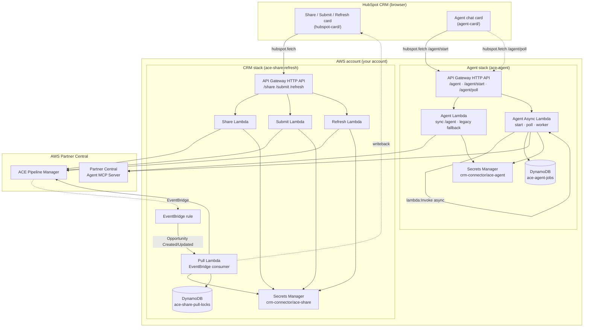

# Architecture

This document covers the design and request flow of both the CRM stack and the Agent stack, plus day-2 operations and the verbatim-error catalogue. For step-by-step deployment see [`docs/workshop.md`](workshop.md).

## Component diagram



## Request flow — CRM Share button

1. Rep clicks **Share to AWS** on a deal.
2. The card POSTs `{ dealId }` to `<api>/share` via `hubspot.fetch`. HubSpot attaches a v3 HMAC signature in the `X-HubSpot-Signature-V3` header.
3. The Share Lambda verifies the signature using `HUBSPOT_CLIENT_SECRET` from Secrets Manager. Invalid signature → 401.
4. The Lambda reads the deal's `~30` properties from HubSpot (single round-trip) and the deal's primary associated company.
5. **Validation** (`backend/lib/preconditions.ts`): close date set, amount > 0, country code resolvable, postal code, description ≥ 20 chars, deal stage maps to an ACE stage, at least one Solution Offering or `OtherSolutionDescription`. Failures return a 422 with the violated rule names.
6. **Branch** on whether `ace_opportunity_id` is set:
   - **Empty** → create path: `CreateOpportunity` → write back the new ID → one `AssociateOpportunity` per Solution + AWS Product → optionally `StartEngagementFromOpportunityTask`.
   - **Set** → update path: `GetOpportunity` (for `LastModifiedDate` + current associations) → `UpdateOpportunity` → reconcile Solution + AWS Product associations → read back via `GetOpportunity` + `GetAwsOpportunitySummary`.
7. The Lambda writes the AWS-side state back to the deal's `aws_*` and round-trippable `ace_*` properties.

The two Submission_Mode classifications (`Create_And_Submit` vs `Create_Only`) decide whether `StartEngagementFromOpportunityTask` fires on the create path. The update path does **not** auto-submit because the Sandbox catalog's `UpdateOpportunity` strips `ReviewStatus` to null when the field is absent on the wire — see ["Why does Update preserve `LifeCycle.ReviewStatus`?"](#why-does-update-preserve-lifecyclereviewstatus) below.

## Request flow — CRM EventBridge auto-pull

> **Prerequisite — Partner Central event publishing.** The Pull Lambda only fires when AWS Partner Central is actually publishing `aws.partnercentral-selling` events into your account's default EventBridge bus. Per [AWS's selling-API events docs](https://docs.aws.amazon.com/partner-central/latest/APIReference/selling-api-events.html) (content rephrased for compliance), the partner's IAM principal needs `events:PutRule` permission scoped to `events:source = aws.partnercentral-selling`, and the partner organisation must have opted into the Partner Central event-notification feature on the account. **If your account hasn't done this**, the EventBridge rule the CRM stack creates will deploy successfully but stay idle — no events ever arrive. The card's manual **Refresh from AWS Partner Central** button doubles as a backfill mechanism in that scenario: it reads the live AWS state via `GetOpportunity` / `GetAwsOpportunitySummary` and writes back to HubSpot, on demand.
>
> Decision matrix:
>
> | EventBridge enabled? | AWS → HubSpot sync mode | |---|---| | Yes | Real-time, automatic. Pull Lambda fires within seconds of any AWS-side change. Refresh button still works for manual re-sync. | | No | Manual only. Click Refresh on each deal whenever you need to pull AWS-side state. The deployed EventBridge rule is harmless but unused — leave it in place; turning Partner Central events on later "lights up" the path with no redeploy needed. |

The CRM stack subscribes to AWS EventBridge events from `aws.partnercentral-selling`:

1. AWS emits an `Opportunity Created` or `Opportunity Updated` event whenever a Partner-Central-side change happens (UI edit, agent-driven write, AWS-shared invitation accepted).
2. The Pull Lambda receives the event filtered by `detail.catalog`.
3. **Search** for an existing HubSpot deal with `ace_opportunity_id == <event.detail.id>`.
4. **If found**: run the same logic the Refresh button runs — write the AWS-side state to the deal.
5. **If not found**: create a new HubSpot deal at `PULL_DEFAULT_STAGE` seeded from AWS state.

A DynamoDB lock table (`ace-share-pull-locks`) prevents Pull and the Share-time post-create writeback from racing on the same deal.

End-to-end latency is typically 2-3 seconds.

## Request flow — Agent

1. Rep types a message in the Agent card.
2. The card POSTs to `<api>/agent/start` with `{ message, sessionId, dealId }`.
3. The async Lambda verifies the v3 HMAC signature, writes a `pending` row to DynamoDB (`ace-agent-jobs`, TTL=1h), async-invokes itself with the worker payload via `lambda:Invoke` (`InvocationType: "Event"`), and returns `{ ok: true, jobId }` in <100ms.
4. The card immediately starts polling `<api>/agent/poll?jobId=<uuid>` every 1.5s.
5. The worker invocation runs untethered from API Gateway with the full 5-minute Lambda timeout.
   - **Optional** (when `HUBSPOT_PRIVATE_APP_TOKEN` is configured): the worker reads the deal's properties from HubSpot and prepends a context preamble like *"You are acting on HubSpot deal 12345 with opportunity O123 in Pending Submission state..."* so the agent has the deal context without the rep having to paste it.
   - The worker SigV4-signs a JSON-RPC 2.0 message to the Partner Central Agent MCP Server's `/sendMessage` endpoint and waits for the response.
   - On return, the worker writes the `AgentResponse` to DynamoDB and marks the job `complete` (or `error`).
6. The card's next poll picks up the result and renders. The poll handler is a single DynamoDB GetItem — cheap.
7. **Approval gate**: when the agent wants to call a write tool (e.g. `CreateOpportunity`, `UpdateOpportunity`), the response carries an `approval_request` block. The card renders Approve / Reject / Override buttons. The user's choice POSTs back through the same `/agent/start` + poll cycle — never the synchronous route.

The Agent never receives long-lived credentials — SigV4 signing uses the Lambda execution role's own credentials at runtime.

A separate synchronous `POST /agent` route + Lambda is still deployed (in the same CFN stack) but the card no longer routes traffic through it. It exists as a fallback for direct-curl debugging or for partners who want a synchronous interface for their own tooling.

## Design decisions

### Why async start+poll for the Agent path?

API Gateway HTTP APIs cap integration timeouts at 30 seconds. The Partner Central Agent MCP Server's `sendMessage` regularly takes 25-40 seconds for tool-call approvals as session context grows. A synchronous Lambda-fronted-by-API-Gateway hits that ceiling routinely and surfaces "Gateway took too long" to the user, even though the underlying AWS write usually completed.

The async pattern decouples the wire-call duration from MCP's response time:

- `POST /agent/start` returns in <100 ms with a `jobId`. The card unblocks immediately.
- The worker invocation runs at 5-minute Lambda timeout, untethered from API Gateway.
- The card polls `GET /agent/poll` every 1.5 s. Each poll is a single DynamoDB GetItem.

Why not Server-Sent Events on the wire (the AWS-recommended path for long MCP calls)? `hubspot.fetch` is a JSON request/response wrapper — it can't consume an SSE stream from inside a HubSpot UI Extension. The async-poll pattern delivers the same UX without that constraint.

A second motivation: MCP scopes sessions by SigV4 caller identity. When we initially split the workload across two Lambdas with two IAM roles (a sync Lambda for chat + an async Lambda for bulk imports), sessions created by one role were invisible to the other, producing intermittent `ResourceNotFoundException` errors mid-conversation. Routing every card→backend call through the same async Lambda + role keeps session continuity working.

### Why two stacks instead of one?

The CRM and Agent integrations have **almost no shared infrastructure**. They have separate Lambdas, separate Secrets Manager blobs, separate IAM roles (different managed policies), separate API Gateways. Combining them into a single CFN template via conditionals adds complexity without saving deploys — the unified deploy script drives both stacks from one command, which is the actual partner UX win. Keeping them as two stacks means you can redeploy either independently and a security incident in one doesn't bleed into the other.

### Why is the `hubspot-card/` API URL gitignored?

Each partner's deployed API URL is unique (e.g. `abc123.execute-api.us-east-1.amazonaws.com`). Committing it would make the upstream public repo carry a value that's only valid for one specific deployer. The deploy script writes to a gitignored `config.local.ts` file and a gitignored `app-hsmeta.json` so:

- Fresh `git clone` + `npm install` materialises placeholder templates that build cleanly.
- After deploy, the local files carry the real URL and `hs project upload` ships against the real API.
- A `git pull` from upstream never overwrites the local URL.

### Why does Update preserve `LifeCycle.ReviewStatus`?

Empirically, the Sandbox catalog's `UpdateOpportunity` API silently strips `ReviewStatus` to null when the field is absent on the wire. This permanently orphans the opportunity (`SubmitOpportunity` requires `ReviewStatus ∈ {Pending Submission, Action Required}`). The fix: read the current `ReviewStatus` from `GetOpportunity` and echo the same value back on `UpdateOpportunity` as a safe same-value passthrough. AWS docs describe `ReviewStatus` as read-only on update, but the same-value passthrough is accepted in practice.

Full reproduction:

1. `CreateOpportunity` → opp lands at `ReviewStatus = "Pending Submission"`.
2. `UpdateOpportunity` (without `LifeCycle.ReviewStatus` in the payload) → opp's `ReviewStatus` resets to `null`.
3. `StartEngagementFromOpportunityTask` → AWS rejects with `OPPORTUNITY_VALIDATION_FAILED`.

For opps already orphaned before the fix landed, the only AWS-side recovery is `UpdateOpportunity` with `ReviewStatus: "Action Required"`, which is rejected on the production AWS catalog. Practical recovery: clone the HubSpot deal to a new deal and re-share.

### Why is the Share button hidden in some review states?

Once the opp is at `aws_review_status ∈ {Pending Submission, "", Submitted, In Review}`, clicking Share is either pointless (already saved, will fail) or actively harmful (could trigger the ReviewStatus-strip bug above). The card hides Share entirely in these states. The user's only path forward is Submit (for draft-state opps) or waiting for AWS review to complete (for Submitted / In Review).

### Why is `ace_solutions` and `ace_aws_products` required-or-Other for Solutions but optional for Products?

AWS Partner Central requires either at least one Solution Offering or a non-blank `OtherSolutionDescription` on every opportunity — that's a hard precondition. AWS Products are entirely optional; an opportunity can ship with zero products. The card surfaces Products as an info row (ℹ️) when populated and omits the row when blank.

## Cost model

Approximate monthly cost for a partner running ~300 Share clicks / ~100 Submit clicks / ~500 Refresh clicks / ~100 EventBridge events:

| Component | Cost / month |
|---|---|
| Secrets Manager (CRM) | $0.40 |
| Secrets Manager (Agent) | $0.40 |
| Lambda invocations (across all 6 functions, 1M free + per-invoke) | <$0.01 |
| API Gateway HTTP API (CRM + Agent routes combined) | <$0.05 |
| DynamoDB on-demand (`ace-share-pull-locks` + `ace-agent-jobs`) | <$0.02 |
| EventBridge rule | <$0.01 |
| CloudWatch Logs (1GB free + retention) | <$0.05 |
| **Total CRM stack** | ~$0.45 |
| **Total Agent stack** | ~$0.45 |
| **Total CRM-and-Agent** | ~$0.90 |

S3 artifact bucket storage is negligible (~50MB versioned).

## Repository layout

See the [README](../README.md#repository-layout) for a per-directory map.

---

## Day-2 operations

### Parallel environments (`--env-suffix`)

By default both stacks deploy under canonical names (`ace-share-refresh`, `ace-agent`) with canonical resource names (Lambdas, IAM roles, DynamoDB tables, log groups, Secrets Manager secrets). Re-running the deploy in the same account safely updates those resources in place.

If you need a second copy of either stack in the **same AWS account** (for example, dev and prod side-by-side), pass `--env-suffix <name>`:

```bash
# Stand up a "dev" environment alongside the existing canonical one.
./infra/unified-deploy.sh --mode crm-and-agent --env-suffix dev --profile workshop

# Re-deploy "dev" later
./infra/unified-deploy.sh --mode crm-and-agent --env-suffix dev --skip-build -y
```

Behaviour:

- Suffix must be lowercase letters, digits, or hyphens, max 16 chars (CFN parameter constraint).
- The suffix is appended to the CFN stack name (`ace-share-refresh-dev`, `ace-agent-dev`) AND to every globally-scoped resource: Lambda function names, IAM role names, log group names, Secrets Manager secret IDs, DynamoDB table names, HTTP API names, EventBridge rule name.
- Empty / unset suffix preserves the canonical names — existing deploys keep working unchanged after picking up the template change.
- Both deploys share the same artifact S3 bucket (`ace-share-refresh-deploy-<account>-<region>`); zips are content-hashed so there's no collision.
- Each environment writes a fresh `crm-connector/ace-share-<suffix>` secret and a fresh DynamoDB table — populate them via `./infra/set-secrets.sh` and `./agent-infra/set-secrets.sh` separately.

> Card-side caveat: `agent-card/src/app/cards/config.local.ts` and `agent-card/src/app/app-hsmeta.json` get overwritten on every deploy with whatever stack ran last. With dev + prod in the same HubSpot portal, the **last deploy wins on the card side**. Either keep two checkouts of the repo (one per environment), or run `hs project upload` immediately after each deploy before swapping.

### Tail Lambda logs

```bash
# CRM stack
./infra/tail-logs.sh share | refresh | submit | pull | all

# Agent stack
./agent-infra/tail-logs.sh sync | async | all
```

### Force-bounce warm Lambda containers

Secrets Manager updates don't auto-bounce Lambda containers — warm containers keep serving the old values until they cold-start.

**Easiest path: let `set-secrets.sh` do it.** Pass `--auto-bounce` and the script updates the secret AND bounces every Lambda in the stack, reading each function's existing env vars first and only bumping a no-op `FORCE_REFRESH` timestamp (so it never drops `PULL_LOCK_TABLE`, `AGENT_JOB_TABLE`, etc.). It discovers the function names from the stack, so it works regardless of `--env-suffix`:

```bash
./infra/set-secrets.sh HUBSPOT_CLIENT_SECRET --auto-bounce
./agent-infra/set-secrets.sh HUBSPOT_CLIENT_SECRET --auto-bounce
```

**Manual path** (if you changed config outside `set-secrets.sh`). Lambda rejects concurrent `update-function-configuration` calls against the same function (`ResourceConflictException`), so each loop waits for the previous update to settle before moving on.

> If you deployed with `--env-suffix <name>`, append `-<name>` to every Lambda function name in the loops and to `ACE_SHARE_SECRET_ID` / `ACE_AGENT_SECRET_ID`. Easier: use the `--auto-bounce` path above — it fills in the correct suffixed names automatically.

```bash
STAMP=$(date +%s)

# CRM stack
for fn in ace-share-ShareLambda ace-share-RefreshLambda ace-share-PullLambda ace-share-SubmitLambda; do
  aws lambda update-function-configuration --function-name "$fn" \
    --region "${AWS_REGION:-us-east-1}" \
    --environment "Variables={ACE_SHARE_SECRET_ID=crm-connector/ace-share,LOG_LEVEL=info,FORCE_REFRESH=${STAMP}}" \
    > /dev/null
  aws lambda wait function-updated --function-name "$fn" \
    --region "${AWS_REGION:-us-east-1}"
  echo "  bounced $fn"
done

# Agent stack — bounce BOTH (sync + async)
for fn in ace-agent-AgentLambda ace-agent-AgentAsyncLambda; do
  aws lambda update-function-configuration --function-name "$fn" \
    --region "${AWS_REGION:-us-east-1}" \
    --environment "Variables={ACE_AGENT_SECRET_ID=crm-connector/ace-agent,LOG_LEVEL=info,FORCE_REFRESH=${STAMP}}" \
    > /dev/null
  aws lambda wait function-updated --function-name "$fn" \
    --region "${AWS_REGION:-us-east-1}"
  echo "  bounced $fn"
done
```

> `update-function-configuration` REPLACES the env var map. Read existing values first via `aws lambda get-function-configuration` so you don't drop required vars (e.g. CRM Pull Lambda needs `HUBSPOT_PIPELINE_ID`, `PULL_DEFAULT_STAGE`, `PULL_LOCK_TABLE`; Agent async Lambda needs `AGENT_JOB_TABLE`).

### Rotate secrets

```bash
# Single key, hidden stdin. --auto-bounce updates the secret AND
# restarts the lambdas in one step:
./infra/set-secrets.sh HUBSPOT_PRIVATE_APP_TOKEN --auto-bounce
./infra/set-secrets.sh HUBSPOT_CLIENT_SECRET --auto-bounce
./infra/set-secrets.sh STAGE_MAPPING --auto-bounce
./infra/set-secrets.sh AWS_ACE_ACCESS_KEY_ID AWS_ACE_SECRET_ACCESS_KEY --auto-bounce

# Agent stack equivalents:
./agent-infra/set-secrets.sh HUBSPOT_CLIENT_SECRET --auto-bounce
./agent-infra/set-secrets.sh HUBSPOT_PRIVATE_APP_TOKEN --auto-bounce
./agent-infra/set-secrets.sh ACE_AGENT_CATALOG --auto-bounce   # "Sandbox" or "AWS"
```

Without `--auto-bounce` the script just updates the secret and prints how to bounce manually. For AWS access keys, deactivate (don't delete) the OLD key for ~24h in case of rollback.

### Customising stage mapping

The CRM stack maps HubSpot deal stages to AWS Partner Central stages via `STAGE_MAPPING` in Secrets Manager. The default covers HubSpot's standard 7-stage pipeline. For custom pipelines:

```bash
python -m src.main list-stages   # prints HubSpot stage IDs
./infra/set-secrets.sh STAGE_MAPPING
# Paste like:
# appointmentscheduled=Qualified;qualifiedtobuy=Qualified;closedwon=Launched;closedlost=Closed Lost
```

Multiple HubSpot stages can map to the same ACE stage. On Refresh (reverse direction: ACE → HubSpot), the **first entry** for a given ACE stage wins.

### Refresh the AWS Products picklist

```bash
curl -sS https://raw.githubusercontent.com/aws-samples/partner-crm-integration-samples/main/resources/SampleAWSProducts.csv > /tmp/SampleAWSProducts.csv
CSV_PATH=/tmp/SampleAWSProducts.csv \
  HUBSPOT_PRIVATE_APP_TOKEN="$(./scripts/get-hubspot-token.sh)" \
  python3 scripts/seed-aws-products-picklist.py
```

The script PATCHes existing options without recreating the property, so existing deal values are preserved. `--dry-run` prints the planned API call without sending.

### Optional: auto-copy company → deal address fields (HubSpot Workflow)

By default the Share lambda falls back from the deal's `ace_*` properties to the associated company's `hs_country_code` / `state` / `zip`. If you want HubSpot to copy company values onto the deal directly (so the deal carries customer info standalone), set up a Workflow:

1. **Automation → Workflows → Create workflow → From scratch**, object type **Deal**.
2. Trigger: `Primary associated company is known` (enable re-enrolment on the same trigger).
3. Add **Set property value** actions reading from the Primary associated company:

   | Source (company) | Destination (deal) |
   | --- | --- |
   | `name` | `ace_company_name` |
   | `country` | `ace_country_code` |
   | `zip` | `ace_postal_code` |
   | `state` | `ace_state_or_region` |
   | `city` | `ace_city` |
   | `domain` | `ace_website_url` |

4. Turn the workflow **on**.

### Verify the deployed Lambda matches the local zip

> Append `-<suffix>` to the function name if you used `--env-suffix`.

```bash
# Local zip's hash (base64 SHA256)
openssl dgst -sha256 -binary backend/dist/share.zip | base64

# Deployed CodeSha256
aws lambda get-function-configuration --function-name ace-share-ShareLambda \
  --region us-east-1 --query CodeSha256 --output text
```

Mismatch indicates either a stale zip or a manual hot-patch outside CFN.

### Delete the deployed stacks

> If you deployed with `--env-suffix <name>`, append `-<name>` to every stack name, log group, and secret ID below.

```bash
# 1. CFN stacks
aws cloudformation delete-stack --stack-name ace-share-refresh --region us-east-1
aws cloudformation delete-stack --stack-name ace-agent --region us-east-1
aws cloudformation wait stack-delete-complete --stack-name ace-share-refresh --region us-east-1
aws cloudformation wait stack-delete-complete --stack-name ace-agent --region us-east-1

# 2. Artifact buckets
ACCOUNT=$(aws sts get-caller-identity --query Account --output text)
for bucket in ace-share-refresh-deploy-${ACCOUNT}-us-east-1 ace-agent-deploy-${ACCOUNT}-us-east-1; do
  aws s3 rm "s3://$bucket" --recursive
  aws s3api delete-bucket --bucket "$bucket" --region us-east-1
done

# 3. CloudWatch log groups
for group in /aws/lambda/ace-share-{ShareLambda,RefreshLambda,SubmitLambda,PullLambda} /aws/lambda/ace-agent-{AgentLambda,AgentAsyncLambda}; do
  aws logs delete-log-group --log-group-name "$group" --region us-east-1 || true
done

# 4. Secrets Manager (skip 7-day deletion window)
aws secretsmanager delete-secret --secret-id crm-connector/ace-share --force-delete-without-recovery --region us-east-1
aws secretsmanager delete-secret --secret-id crm-connector/ace-agent --force-delete-without-recovery --region us-east-1
```

(Optional) delete the HubSpot custom properties via the Properties UI and the uploaded UI Extensions via the Developer Projects panel.

---

## Common errors

Each entry is keyed off a verbatim error string you'll see either in `ace_sync_error` on the deal or in the Lambda's CloudWatch logs.

### Pull Lambda never fires (AWS-side edits don't reverse-sync)

The CRM stack's EventBridge rule deploys harmlessly idle when the partner's account hasn't enabled `aws.partnercentral-selling` event publishing yet. AWS-side edits stay invisible to HubSpot until the rep clicks Refresh on the deal. Confirm whether events are arriving:

```bash
# 1. Confirm the rule is enabled and using the right pattern.
#    (Append `-<suffix>` to the rule name if you used --env-suffix.)
aws events describe-rule \
  --name ace-share-PullEventRule \
  --profile workshop --region us-east-1 \
  --query "{State:State,EventPattern:EventPattern}" --output json

# 2. Count matched events over the last 7 days. Zero matches while
#    AWS-side edits have happened means events aren't arriving.
aws cloudwatch get-metric-statistics \
  --namespace AWS/Events \
  --metric-name MatchedEvents \
  --dimensions Name=RuleName,Value=ace-share-PullEventRule \
  --start-time "$(date -v-7d -u +%Y-%m-%dT%H:%M:%S 2>/dev/null || date -d '7 days ago' -u +%Y-%m-%dT%H:%M:%S)" \
  --end-time   "$(date -u +%Y-%m-%dT%H:%M:%S)" \
  --period 86400 --statistics Sum \
  --profile workshop --region us-east-1 \
  --query "Datapoints[*].[Timestamp,Sum]" --output table
```

If `State: ENABLED` and matched-event sum is 0 across the window during which AWS-side edits happened, the partner organisation hasn't completed the Partner Central event-notification setup yet. Per AWS's [selling-API events guide](https://docs.aws.amazon.com/partner-central/latest/APIReference/selling-api-events.html) (content rephrased for compliance):

1. Opt into the Partner Central event-notification feature on the AWS Partner Network account (Client Credentials flow setup).
2. Ensure the partner's IAM principal has `events:PutRule` permission scoped to `events:source = aws.partnercentral-selling`.
3. Wait up to 24h after enabling, then re-check `MatchedEvents`. If still zero, contact Partner Central support — sometimes there's a backend whitelist step.

In the meantime, the **Refresh** button on each deal serves as the manual backfill: it runs the same `GetOpportunity` / `GetAwsOpportunitySummary` reads the Pull Lambda would have run on an event. See § Request flow — CRM EventBridge auto-pull above for the full design.

### `Configuration error: missing secrets: HUBSPOT_CLIENT_SECRET`

Re-run `./infra/set-secrets.sh HUBSPOT_CLIENT_SECRET` (or `./agent-infra/set-secrets.sh HUBSPOT_CLIENT_SECRET`), then bounce the lambdas.

### `Authorization failed. Reload the HubSpot page and try again`

The `HUBSPOT_CLIENT_SECRET` in Secrets Manager doesn't match the value on the HubSpot Private App's Auth tab. Copy from HubSpot Settings → Integrations → Legacy apps → your app → Auth → Client Secret, update Secrets Manager, bounce the lambdas. (Note: HubSpot renamed "Private Apps" to "Legacy apps" in 2026; functionality is unchanged.)

### `Unexpected response from backend (status 403)`

Card is calling a URL that's not in `permittedUrls.fetch`. Hard-reload the deal page first (Cmd+Shift+R / Ctrl+Shift+R). If still failing, re-run `infra/deploy.sh` (or `agent-infra/deploy.sh`) and `cd hubspot-card && hs project upload`.

### `Cannot share: solutions`

`ace_solutions` is empty AND `ace_other_solution_description` is empty. Pick a Solution Offering from the deal's multi-checkbox picklist or fill in the free-text alternative. Parser accepts `;`, `,`, or whitespace as separators.

### `Cannot share: closedate` / `amount`

HubSpot's built-in `closedate` is empty or `amount` is zero/missing/negative. Edit the deal — live updates flow through without a page reload.

### `Cannot share: countryCode` / `stateOrRegion` / `postalCode`

Address can't be resolved from the deal's `ace_*` overrides or the associated company. Set the value on either the deal or the company.

### `Cannot share: descriptionLength`

Built-in `description` is shorter than 20 characters. Maps to AWS's `Project.CustomerBusinessProblem`.

### `Cannot share: stageMappable`

Deal's `dealstage` isn't in `STAGE_MAPPING`. See the [stage mapping](#customising-stage-mapping) section above.

### `BUSINESS_VALIDATION_EXCEPTION lifeCycle.targetCloseDate: Target Close Date should be a future date`

`closedate` is in the past or today. Edit it.

### `BUSINESS_VALIDATION_EXCEPTION primaryNeedsFromAws: Cannot set visibility to limited on a Co-Sell opportunity`

`ace_involvement_type = "Co-Sell"` AND `ace_visibility = "Limited"`. AWS only allows `Limited` with `For Visibility Only`. Change either field. The card detects this preemptively and disables the Submit button.

### `ACTION_NOT_PERMITTED: You cannot perform Submit action`

The opportunity's `LifeCycle.ReviewStatus` is null. Fixed in current code (the lambda preserves `ReviewStatus` on every Update via same-value passthrough). Already-orphaned opps from before the fix have no clean recovery — clone the HubSpot deal to a new one or delete and re-share.

### `STALE_OPPORTUNITY: This deal changed in ACE since you last synced.`

Click Refresh on the card to pull the latest AWS state, then Share again. The lambda already retries once internally; this surfaces only after both attempts conflict.

### `Session expired or resource not found. Click "New conversation" and try again.`

MCP evicted the agent session (in practice sooner than the documented 48h TTL). The card auto-clears the dead `sessionId` so the next message starts fresh. Click **New conversation** for an explicit reset.

### `AWS Partner Central encountered an internal error. Try again.`

MCP `-32603 INTERNAL_ERROR` — the catch-all for server-side failures. Usually resolves on retry. Persistent? Check `./agent-infra/tail-logs.sh async`.

### Bulk import shows "Batch N failed"

```bash
./agent-infra/tail-logs.sh async
# In another terminal, find the verbatim error:
aws logs filter-log-events --log-group-name /aws/lambda/ace-agent-AgentAsyncLambda \
  --filter-pattern '"<jobId-from-the-error>"'
```

### `npm install` fails with "module not found ./config.local"

Postinstall hook didn't run. From the affected card directory:

```bash
node ../scripts/prepare-card-config.mjs
```

### `Conflicting error, last modified date is not the latest`

Lambda's expected retry shape. A single-occurrence error followed by a successful retry is normal. Two consecutive failures surface as `STALE_OPPORTUNITY` (above).

### Checklist still shows red after I populated the field

Hard-reload the deal page. If the issue persists for a property the card doesn't subscribe to, that property's name needs to be added to `DEAL_PROPERTY_NAMES` in `hubspot-card/src/app/cards/AceShareCard.tsx`.
