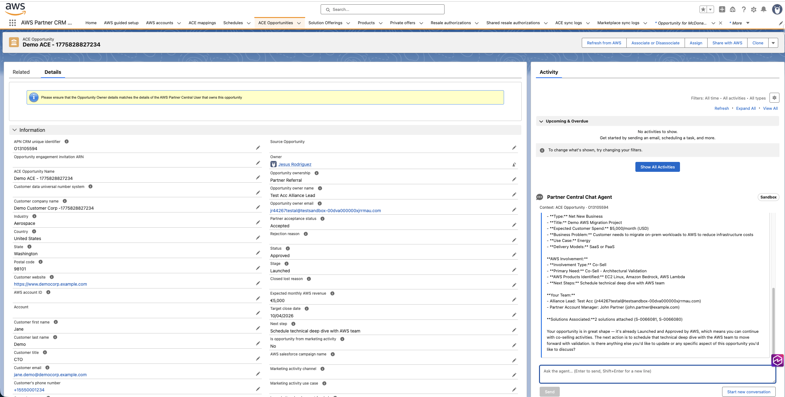
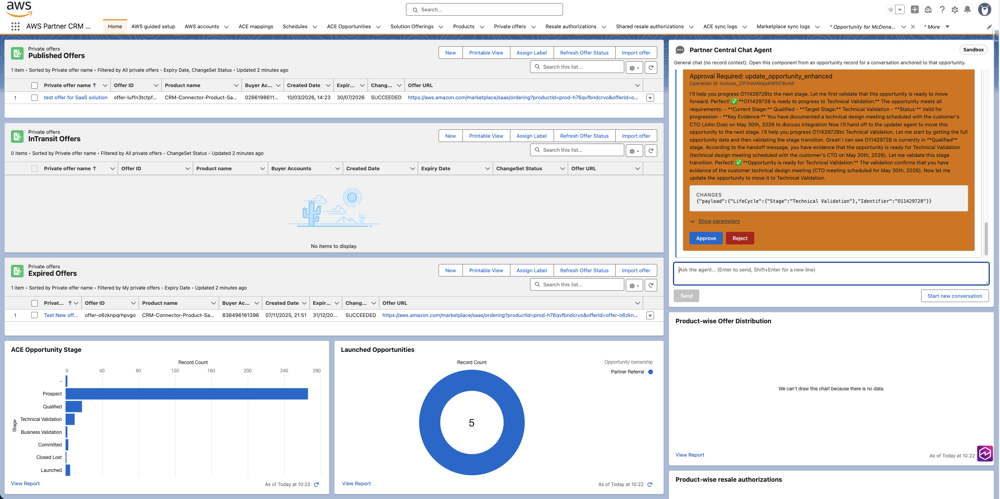
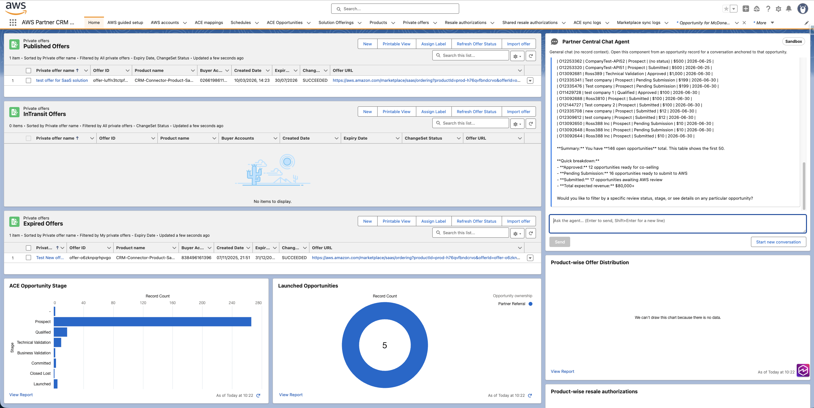

# Partner Central Chat Agent

A Salesforce-hosted chat Lightning Web Component (LWC) that lets AWS partner users converse with the [AWS Partner Central agents MCP Server](https://docs.aws.amazon.com/partner-central/latest/APIReference/partner-central-mcp-server.html) directly from Lightning. Drops onto an ACE Opportunity record page for opportunity-scoped conversations and onto Home / the utility bar for general chat.



## Documentation

- [`docs/design.md`](docs/design.md) — logical architecture, data model, sequence diagrams, JSON-RPC schemas, SSE strategy, approval correlation model
- [`docs/workshop-agent.md`](docs/workshop-agent.md) — step-by-step, Sandbox-first workshop to deploy and try the agent from a fresh org

Treat these as the source of truth for architectural decisions. Update them before changing behavior.


## What it does today

- **Conversational agent** over the Partner Central MCP `sendMessage` tool. Streaming responses render inline.
- **Record-aware context** — on an ACE Opportunity record page, the APN CRM id (`O123456789`) is inlined into every turn so the agent knows exactly which opportunity you mean.
- **Human-in-the-loop approvals** — whenever the agent wants to run a write op (update an opportunity, submit for review, etc.), an Approve / Reject card appears in the transcript. Reject is free; Approve commits the write.

  

- **Per-user, per-record sessions** — each (user, opportunity) pair gets its own `Chat_Session__c` row with the MCP server's session id persisted so multi-turn context survives page reloads.
- **Catalog resolution** — whether the next turn targets the `Sandbox` catalog (the default) or `AWS` production. When the **AWS Partner CRM Connector** is installed, its `awsapn__Companion_App_Settings__c.awsapn__PC_API_Sandbox_Enabled__c` checkbox is authoritative. Without the connector, the catalog comes from `Chat_Agent_Config__mdt.Default.Is_Sandbox__c`, chosen at deploy time via `deploy-and-test.sh --catalog sandbox|aws`. The connector checkbox supersedes the config flag whenever it is installed. A "Sandbox" badge in the chat header indicates when sandbox mode is active.
- **Document attachments** — attach files (PDF, Office docs, CSV/TXT, PNG/JPEG) to a message. The controller validates them (type, size, max 3 per message), uploads each to Partner Central's ephemeral, write-only S3 bucket via a SigV4 Named Credential, and references them as `document` content blocks so the agent can read them (e.g. "create an opportunity from this proposal"). Any resulting write still goes through the approval card.
- **Audit log** — every request and response is persisted to `Audit_Log__c` (bytes redacted, session ids captured) for post-hoc investigation.

## Repository layout

```
docs/                         Design, and Workshop doc
force-app/main/default/       Salesforce DX source
    classes/                  Apex (controller, services, parsers, tests)
    lwc/chatAgent/            The chat LWC
    objects/                  Audit_Log__c, Pending_Write_Operation__c, Chat_Session__c,
                              Chat_Agent_Config__mdt, Chat_Stream_Event__e
    permissionsets/           Partner_Central_Chat_Agent_User
    customMetadata/           Chat_Agent_Config.Default record
manifest/package.xml          Deploy manifest (RunSpecifiedTests)
scripts/
    deploy-and-test.sh        One-shot deploy with tests
    smoke/                    End-to-end smoke test (tier 1 plumbing, tier 2 live,
                              tier 3 approval round-trip) — see scripts/smoke/README.md
sfdx-project.json             SFDX manifest
```

## Prerequisites

- [Salesforce CLI](https://developer.salesforce.com/tools/salesforcecli) (`sf` v2+)
- A target org with:
    - A Named Credential named `AWS_Partner_Central_MCP` pointing at `https://partnercentral-agents-mcp.us-east-1.api.aws/mcp` with SigV4 against service `partnercentral-agents-mcp`, region `us-east-1`. **Do not reuse** `AWS_Partner_Central_API` — that one belongs to the connector and targets a different endpoint.
    - The IAM identity behind the credential must hold **both** managed policies: `AWSMcpServiceActionsFullAccess` (invoke the MCP service) and `AWSPartnerCentralOpportunityManagement` (list, create, and update opportunities). The first alone connects but the agent will report it lacks a `partnercentral:` permission.
    - A user assigned the `Partner_Central_Chat_Agent_User` permission set.
    - **Optional (document attachments)**: a second Named Credential `AWS_Partner_Central_S3` (SigV4, service `s3`, region `us-east-1`, URL `https://s3.us-east-1.amazonaws.com`) whose IAM identity holds only `s3:PutObject` on `s3://aws-partner-central-marketplace-ephemeral-writeonly-files/<your-account-id>/*`, plus `Chat_Agent_Config__mdt.Default.Aws_Account_Id__c` set to that account id. Leave these unset to run text-only; attachments then fail closed with a config error.
    - **Optional**: the AWS Partner CRM Connector (`awsapn__` namespace). It is not required — general chat works standalone. Install it for record-aware chat on ACE Opportunities and to let its sandbox checkbox drive the catalog (it then supersedes the config flag).

See [`docs/workshop-agent.md`](docs/workshop-agent.md) for the full Sandbox-first walkthrough, including creating the Named Credential and registering a Sandbox partner.

## Deploy

```bash
# Deploy and run only this spec's tests (RunSpecifiedTests).
# Targets the Sandbox catalog by default; pass --catalog aws for production.
./scripts/deploy-and-test.sh <target-org-alias>
./scripts/deploy-and-test.sh <target-org-alias> --catalog aws
```

The script runs `ChatAgentControllerTest` and `ChatAgentCoverageTests`. A clean run is 100+ tests passing, no coverage warnings. The `--catalog` flag sets `Chat_Agent_Config.Default.Is_Sandbox__c` for the deploy; if the AWS Partner CRM Connector is installed, its sandbox checkbox supersedes that flag.

## Install on a record page / Home / utility bar

1. Open an ACE Opportunity (or Home). Gear icon → Edit Page → Lightning App Builder.
2. Drag **"Partner Central Chat Agent"** from the custom components palette into a region.
3. Save → Activate → assign as Org Default (or per-profile / per-app as you prefer).
4. Hard-refresh (Cmd+Shift+R / Ctrl+Shift+R).

For an always-visible general chat, add it as a Utility Bar item under Setup → App Manager → (your app) → Utility Items.



## Smoke test

After deploy, verify the server-side paths end-to-end against the live org:

```bash
# Tier 1: config + session + connector detect (no MCP calls, always safe)
./scripts/smoke/smoke-test.sh <target-org-alias>

# Tier 2: + one live sendMessage turn
./scripts/smoke/smoke-test.sh <target-org-alias> --live

# Tier 3: + full approval round-trip (auto-rejects; no writes commit)
./scripts/smoke/smoke-test.sh <target-org-alias> --approve
```

See [`scripts/smoke/README.md`](scripts/smoke/README.md) for what each tier proves.

## Future improvements

Features on the roadmap but not yet wired.

### In-app catalog override

Removed deliberately. The catalog is a deploy-time and admin decision, not a per-user one: standalone deployments set it via `deploy-and-test.sh --catalog` (the `Is_Sandbox__c` config flag), and when the AWS Partner CRM Connector is installed its sandbox checkbox supersedes that. If partner teams later need to run AWS and Sandbox in parallel on one org, bring back the catalog dropdown (it was in the LWC as of task 14 follow-up; git history has the implementation).

### Bulk operations

Not an MCP primitive. The agent can apply many sequential updates, but each write still emits its own approval card. If bulk matters for your workflow, consider a separate Apex job that iterates and calls the agent per row, or wait for AWS to ship a `bulkUpdate` MCP tool.

## Contributing

- Update [`docs/`](docs/) before changing behavior
- Keep Apex test coverage at or above 75% per class; `deploy-and-test.sh` warns if it drops
- New LWC state → add a test; new server path → add an integration test in `ChatAgentCoverageTests`
- Never commit secrets or a real Named Credential config — those are provisioned per-org
