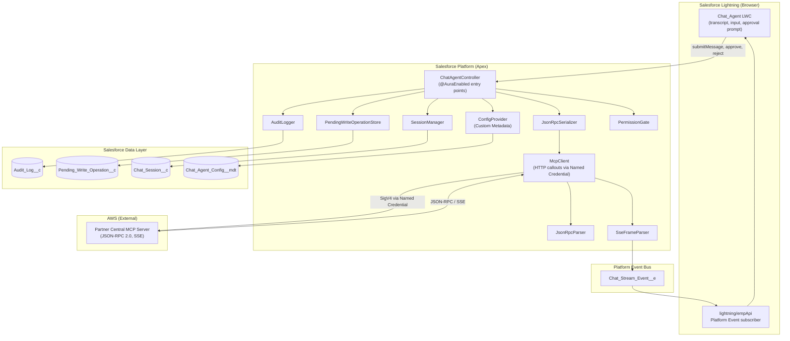
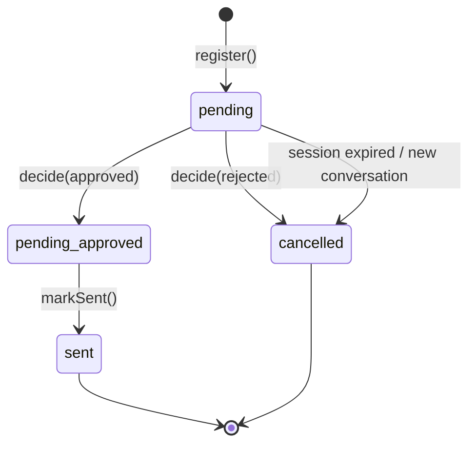
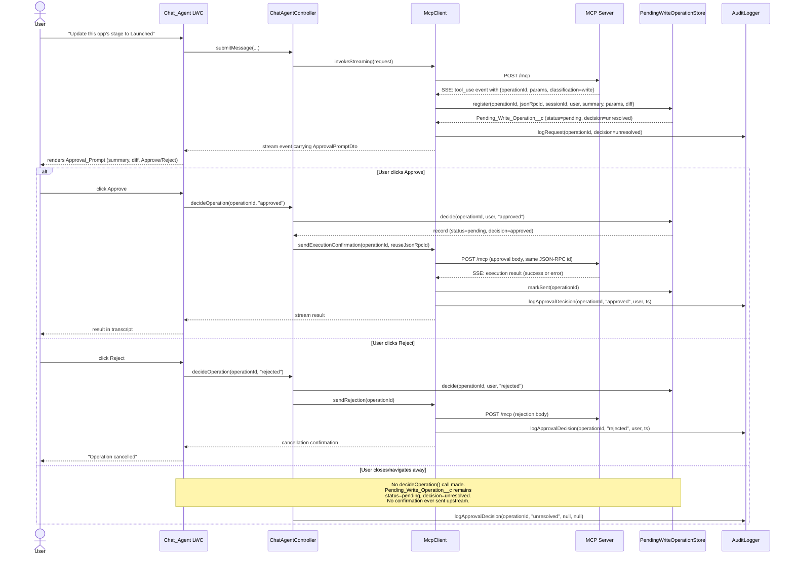
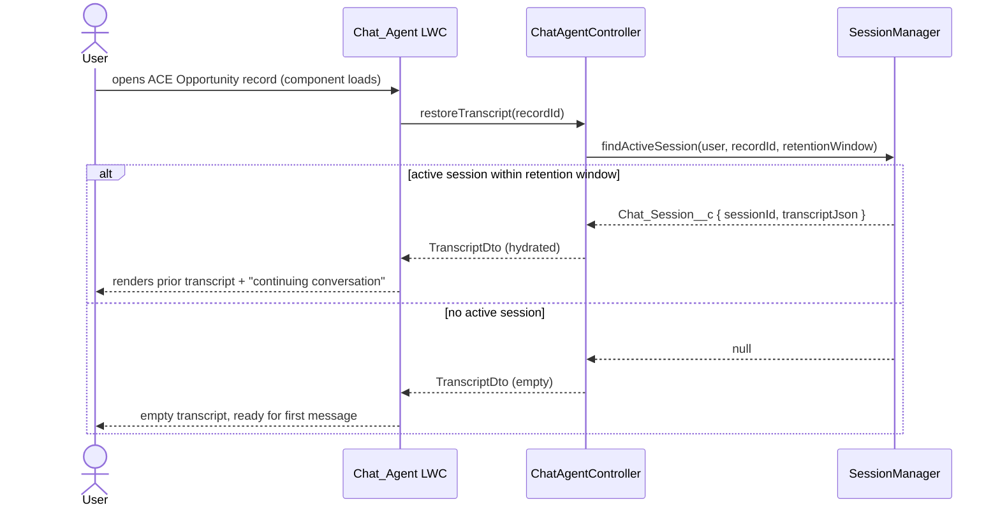

# Design Document

## Overview

The Partner Central Chat Agent is a Salesforce-hosted conversational experience embedded on Salesforce pages (Home, the utility bar, or any record page, with optional first-class support for the AWS Partner CRM Connector's ACE_Opportunity object) that lets partner sales users converse with the AWS Partner Central agents MCP Server. The user interacts through a Lightning Web Component (LWC); outbound JSON-RPC 2.0 calls are made from Apex using the `AWS_Partner_Central_MCP` Named Credential (SigV4, pointing at `https://partnercentral-agents-mcp.us-east-1.api.aws/mcp`). This credential is separate from the `AWS_Partner_Central_API` credential installed by the AWS Partner CRM Connector, which targets the Partner Central REST API and is unsuitable for JSON-RPC/MCP traffic. Responses may be unary JSON-RPC or streamed via Server-Sent Events; the agent renders tokens incrementally in the transcript.

Every Write_Operation proposed by the MCP_Server is intercepted by a human-in-the-loop approval mechanism: the LWC displays an Approval_Prompt with a field-level diff, and no execution confirmation is sent upstream until the user explicitly approves. Approvals are correlated to pending operations by Operation_Id with a fail-safe default of `unresolved`, and an idempotency guard prevents double-sends across retries. Every request, response, and approval decision is persisted in an Audit_Log custom object.

### Key Design Decisions

1. **LWC + Apex** (not a managed package-only approach) keeps the surface flexible and lets us use the dedicated `AWS_Partner_Central_MCP` Named Credential directly from Apex.
2. **Apex as the MCP transport layer**: All outbound calls to the MCP_Server go through Apex callouts (never from the browser), because only Apex can sign with the Named Credential and because we must keep `callout=true` / CSP headaches off the LWC.
3. **Streaming via Apex chunking relayed over Platform Events** (not raw SSE in the browser): Salesforce's `HttpRequest` does not expose an incremental read API to Apex, and the LWC cannot issue cross-origin SigV4-signed requests directly. We use a two-step pattern — Apex opens the SSE connection, reads chunks as fast as the platform allows, parses SSE frames, and publishes each parsed frame as a Platform Event. The LWC subscribes over CometD via `lightning/empApi`. See *SSE Handling Strategy* for the full discussion and fallbacks.
4. **Operation_Id-keyed pending registry**: Approvals are tracked in a server-side map (`Pending_Write_Operation__c` custom object) keyed by Operation_Id, so the fail-safe `unresolved` default and idempotency guarantees survive page reloads and transient LWC unmounts.
5. **Custom Metadata Type for configuration**: Named Credential name, timeout, attachment limits, MIME allow-list, session retention, and sandbox flag all live in a `Chat_Agent_Config__mdt`, so administrators can tune behavior without a deploy.
6. **Fail-closed defaults** throughout: missing config, ambiguous Read/Write classification, unresolved approvals, and malformed JSON-RPC all default to the safe path (no callout, require approval, log, surface error).

## Architecture

### Logical Architecture



### Deployment Architecture

The feature ships as a set of Salesforce metadata (LWC bundle, Apex classes, Custom Objects, Custom Metadata Type, Permission Set, Platform Event) deployed inThe entire feature is a single SFDX project deployed to the target Salesforce org. The external dependency is the `AWS_Partner_Central_MCP` Named Credential (SigV4-signed, IAM-backed, pointing at the Partner Central agents MCP endpoint). No middle tier is required for the primary path; a fallback long-polling path is described below for orgs where Platform Event bandwidth is constrained.

### Surface Integration

The AWS Partner CRM Connector is optional. The LWC is exposed as:
- A **Lightning App Page** / **Home Page** / **Record Page** component. On Home, the utility bar, or a standard Opportunity it runs as general chat; on the connector's ACE_Opportunity record page it also gains automatic opportunity context.
- A **Utility Bar** item (optional) for always-available, non-record-scoped conversations.
- An **Agentforce action** wrapper (optional, behind a feature flag) so the same backend can be invoked from Salesforce's Agentforce agent framework. The Agentforce surface reuses `ChatAgentController` verbatim.

## Components and Interfaces

### 1. Chat_Agent (LWC)

**Responsibility**: Render the transcript, capture input, display Approval_Prompts, surface errors, handle attachments, subscribe to Platform Events for streaming tokens.

**Public LWC API (attributes)**:
- `recordId` (String, optional): Injected when placed on a record page.
- `objectApiName` (String, optional): Injected when placed on a record page.

**Key methods (private)**:
- `handleSubmit(text, attachments)` → calls `ChatAgentController.submitMessage`.
- `handleApprove(operationId)` → calls `ChatAgentController.decideOperation(operationId, 'approved')`.
- `handleReject(operationId)` → calls `ChatAgentController.decideOperation(operationId, 'rejected')`.
- `handleStartNew()` → calls `ChatAgentController.startNewSession(recordId)`.
- `onStreamEvent(platformEvent)` → appends token to the in-flight transcript entry.

**Fail-safe behavior**: When the LWC is disconnected (`disconnectedCallback`), in-flight Approval_Prompts are NOT auto-resolved. The server-side `Pending_Write_Operation__c` retains `unresolved` until the user explicitly decides.

### 2. ChatAgentController (Apex)

**Responsibility**: The only `@AuraEnabled` entry point from the LWC. Enforces permission gating, loads configuration, delegates to the service layer, returns structured results. Never exposes Apex exceptions raw to the client; wraps them in `ChatAgentResult`.

**Public methods** (all `@AuraEnabled`; each is a single, non-overloaded signature — the Lightning framework resolves overloaded `@AuraEnabled` methods non-deterministically and can mismarshal complex parameters, so overloads are deliberately avoided):
- `ChatAgentResult submitMessage(String recordId, String objectApiName, String messageText, List<AttachmentDto> attachments, String catalog)` — `catalog` is optional (`"AWS"`/`"Sandbox"`); when null it falls back to the `Is_Sandbox__c` config. The LWC omits it, so the framework passes null.
- `ChatAgentResult decideOperation(String operationId, String decision, String catalog)` — `decision` ∈ {`approved`, `rejected`}; `catalog` optional as above.
- `ChatAgentResult startNewSession(String recordId)`
- `TranscriptDto restoreTranscript(String recordId)`
- `ConfigDto getClientConfig()` — returns only client-safe config (max attachment size, allowed MIME types, sandbox flag).

### 3. JsonRpcSerializer / JsonRpcParser (Apex)

**Responsibility**: Round-trippable serialization/parsing of JSON-RPC 2.0 request and response objects. Kept as a pair of pure Apex classes to enable property-based testing against deterministic fixtures (see *Correctness Properties*).

**JsonRpcRequest shape** (Apex):
```
class JsonRpcRequest {
    String jsonrpc;        // always "2.0"
    String id;             // UUID; reused across retries (Req 9.4)
    String method;         // MCP method name
    Map<String, Object> params;
}
```

**JsonRpcResponse shape** (Apex):
```
class JsonRpcResponse {
    String jsonrpc;        // always "2.0"
    String id;             // matches request id
    Object result;         // present on success
    JsonRpcError error;    // present on failure
}

class JsonRpcError {
    Integer code;
    String message;
    Object data;
}
```

### 4. McpClient (Apex)

**Responsibility**: Issues HTTP callouts to the MCP_Server via the `AWS_Partner_Central_MCP` Named Credential, handles unary JSON-RPC and SSE content types, honors timeouts, surfaces HTTP 4xx/5xx via structured errors (Req 9).

**Key methods**:
- `JsonRpcResponse invokeUnary(JsonRpcRequest req)` — used for short, non-streaming calls.
- `String invokeStreaming(JsonRpcRequest req, String transcriptEntryId)` — opens SSE, reads chunks, parses frames via `SseFrameParser`, publishes each frame as a `Chat_Stream_Event__e`. Returns a stream handle the LWC uses to correlate events.
- `String uploadAttachmentToS3(AttachmentDto att)` — uploads one attachment to the Partner Central ephemeral, write-only S3 bucket via a dedicated SigV4 Named Credential (`s3:PutObject` only), reads the `x-amz-version-id` response header, and returns the `s3://{bucket}/{account-id}/{uuid}/{file}?versionId=...` URI that `ChatAgentController.submitMessage` embeds in a `document` content block. Performs no DML, so uploads can run before the `sendMessage` callout without tripping the no-DML-before-callout rule. Fails closed (`ChatAgentConfigException`) when the S3 credential, bucket, or account id is unset.

**Idempotency**: On retry after transient 5xx or network error (Req 9.4, Req 6.12), the same `id` (JSON-RPC request id) and the same Operation_Id (for writes) are reused. The `PendingWriteOperationStore` enforces idempotency at the approval layer.

### 5. SseFrameParser (Apex)

**Responsibility**: Pure parser over an SSE byte/character stream. Parses frames into `SseFrame { String event; String data; String id; Integer retry; }`. Required to be round-trippable (parse → re-emit → equivalent string, per Req 4.3).

### 6. SessionManager (Apex)

**Responsibility**: Persists `Chat_Session__c` records keyed on `User__c + RecordId__c` so the transcript and Session_ID survive page reloads and re-opens within the retention window (Req 5.1, 5.3). Also handles "start new conversation" by tombstoning the current session (Req 5.4).

### 7. PendingWriteOperationStore (Apex)

**Responsibility**: Source of truth for human-in-the-loop approvals.

**Core operations**:
- `register(operationId, jsonRpcRequestId, sessionId, userId, opSummary, paramsPayload)` — creates a new `Pending_Write_Operation__c` with `Status__c = 'pending'` and `Decision__c = 'unresolved'`.
- `decide(operationId, userId, decision)` — atomic update; returns the updated record. Throws if the record is not in `pending` status or `operationId` is not found (Req 6.10 correlation).
- `markSent(operationId)` — moves `Status__c` from `pending` to `sent` AFTER the execution confirmation has been POSTed successfully. Idempotency check (Req 6.11) reads this status: if `sent`, any further `decide` or send attempt is a no-op that returns the existing record.

**Invariants** (enforced at the service layer and cross-checked in tests):
- At most one approval confirmation is sent to the MCP_Server per Operation_Id (Req 6.11).
- A rejected operation is never approved later for the same Operation_Id (Req 6.6).
- If `Decision__c = unresolved`, the MCP_Client has NOT sent any execution confirmation (Req 6.7).

### 8. ConfigProvider (Apex)

**Responsibility**: Reads `Chat_Agent_Config__mdt` at runtime (no static bind) so admin changes are picked up on the next message (Req 12.2). Exposes strongly typed getters and fails closed when required fields are missing (Req 12.3).

**Catalog resolution** (`isSandbox()`, `getActiveNamedCredentialName()`): the agent targets one Partner Central catalog per turn, `Sandbox` (the default) or `AWS` (production), resolved with connector-supersedes-config precedence:

1. If the AWS Partner CRM Connector is installed, `detectConnectorSandbox()` reads its `awsapn__Companion_App_Settings__c.awsapn__PC_API_Sandbox_Enabled__c` flag and that value wins. The probe is dynamic (`Schema.getGlobalDescribe()` plus dynamic SOQL, wrapped in try/catch) and memoized per transaction, so an org without the managed package, an older package missing the field, an empty settings row, or any FLS/runtime error all return `null`, meaning "no authoritative setting, fall back".
2. Otherwise `isSandbox()` falls back to the standalone `Is_Sandbox__c` config flag, the deploy-time choice (Sandbox-first by default).

`getActiveNamedCredentialName()` keys off the resolved `isSandbox()`, not the raw flag, so the credential always matches the catalog even when the connector supersedes the config. When sandbox is active and `Sandbox_Named_Credential_Name__c` is set it returns that; otherwise it falls back to the base `Named_Credential_Name__c`, because the MCP endpoint is identical for both catalogs (the catalog travels as a request parameter) so a single Named Credential can serve both. `validate()` additionally fails closed when `Is_Sandbox__c` is true but no sandbox credential is configured (Req 13.7).

### 9. AuditLogger (Apex)

**Responsibility**: Writes `Audit_Log__c` rows for each request/response/approval-decision, redacting Attachment contents and sensitive params (Req 10).

### 10. PermissionGate (Apex)

**Responsibility**: Checks that the running user has the `Partner_Central_Chat_Agent_User` Permission Set (Req 11.1, 11.2). Called at the top of every `@AuraEnabled` method.

## Data Models

### Custom Object: `Audit_Log__c`

| Field API Name | Type | Purpose | Req |
|---|---|---|---|
| `User__c` | Lookup(User) | Requesting user's Salesforce User Id | 10.1 |
| `Record_Id__c` | Text(18) | Record_Context record Id (nullable) | 10.1 |
| `Object_Api_Name__c` | Text(80) | Record_Context object (nullable) | 10.1 |
| `Mcp_Method__c` | Text(120) | JSON-RPC method invoked | 10.1 |
| `Session_Id__c` | Text(255) | MCP Session_ID (if known) | 10.1, 10.2 |
| `Json_Rpc_Request_Id__c` | Text(64) | JSON-RPC request id for correlation | 10.1 |
| `Request_Params_Redacted__c` | Long Text Area | Redacted JSON summary of params | 10.1, 10.3 |
| `Request_Timestamp__c` | DateTime | When request was sent | 10.1 |
| `Response_Timestamp__c` | DateTime | When response was received | 10.2 |
| `Http_Status__c` | Number(3,0) | HTTP status code | 10.2 |
| `Operation_Id__c` | Text(64) | Write_Operation Operation_Id (nullable) | 10.4 |
| `Approval_Decision__c` | Picklist | `approved`, `rejected`, `unresolved` | 10.4 |
| `Approval_User__c` | Lookup(User) | Deciding user | 10.4 |
| `Approval_Timestamp__c` | DateTime | When the decision was recorded | 10.4 |
| `Endpoint_Mode__c` | Picklist | `production`, `sandbox` | 13.6 |

Redaction rules: Attachment bytes are NEVER written; they are replaced by `{fileName, mimeType, sizeBytes, sha256}`. Free-text `messageText` is stored (it is the user's own input and already in scope); PII hints (e-mail, phone patterns) can be optionally masked by a future enhancement.

### Custom Object: `Pending_Write_Operation__c`

| Field API Name | Type | Purpose |
|---|---|---|
| `Operation_Id__c` | Text(64), External Id, Unique | MCP-returned Operation_Id |
| `Json_Rpc_Request_Id__c` | Text(64) | Original JSON-RPC id for retry reuse |
| `Session_Id__c` | Text(255) | Associated Session_ID |
| `User__c` | Lookup(User) | User to whom the Approval_Prompt is shown |
| `Record_Id__c` | Text(18) | Associated Record_Context |
| `Operation_Name__c` | Text(120) | MCP method / tool name |
| `Target_Resource_Id__c` | Text(64) | ACE_Opportunity id, Fund Request id, etc. |
| `Summary__c` | Long Text Area | Human-readable summary |
| `Params_Payload__c` | Long Text Area | Full payload that will be submitted |
| `Field_Diff__c` | Long Text Area | Per-field before/after diff |
| `Status__c` | Picklist | `pending`, `sent`, `cancelled` |
| `Decision__c` | Picklist | `approved`, `rejected`, `unresolved` |
| `Decision_Timestamp__c` | DateTime |  |
| `Created_Timestamp__c` | DateTime |  |

**Lifecycle**:


`pending_approved` is an internal transitional label for the `Status__c = pending AND Decision__c = approved` row; once `markSent` succeeds, `Status__c` flips to `sent`. Any further `decide` attempts on a `sent` or `cancelled` row are no-ops (idempotency, Req 6.11).

### Custom Object: `Chat_Session__c`

| Field API Name | Type | Purpose |
|---|---|---|
| `User__c` | Lookup(User) |  |
| `Record_Id__c` | Text(18) |  |
| `Session_Id__c` | Text(255) | MCP-returned Session_ID |
| `Last_Activity__c` | DateTime | For retention-window expiry |
| `Endpoint_Mode__c` | Picklist | `production`, `sandbox` |
| `Transcript_Json__c` | Long Text Area | Serialized transcript (LWC re-hydration) |
| `Is_Active__c` | Checkbox | `false` after "Start new conversation" |

### Custom Metadata Type: `Chat_Agent_Config__mdt`

| Field | Type | Default / Notes |
|---|---|---|
| `Named_Credential_Name__c` | Text(80) | e.g., `AWS_Partner_Central_MCP` |
| `Sandbox_Named_Credential_Name__c` | Text(80) | Optional alternate credential for the Sandbox catalog; required when `Is_Sandbox__c` is true; falls back to the base credential otherwise |
| `Is_Sandbox__c` | Checkbox | Standalone catalog flag (Sandbox-first, defaults true); the connector checkbox supersedes it when the connector is installed; drives the UI badge |
| `Request_Timeout_Seconds__c` | Number(3,0) | Default 120 (Req 9.3) |
| `Session_Retention_Minutes__c` | Number(5,0) | Default 60 |
| `Max_Attachment_Size_Bytes__c` | Number(10,0) | Default 10_000_000 |
| `Allowed_Mime_Types__c` | Long Text Area | CSV: `application/pdf,...` |
| `Sse_Enabled__c` | Checkbox | Feature flag for streaming path |
| `S3_Named_Credential_Name__c` | Text(80) | SigV4 Named Credential (service `s3`) for attachment `PutObject`. Optional; required only for attachments |
| `S3_Bucket_Name__c` | Text(255) | Partner Central ephemeral attachment bucket; used to build the `s3Uri` |
| `Aws_Account_Id__c` | Text(12) | AWS account id used as the S3 key prefix (`s3://bucket/{account-id}/...`). Optional; required only for attachments |

### Platform Event: `Chat_Stream_Event__e`

| Field | Type | Purpose |
|---|---|---|
| `Transcript_Entry_Id__c` | Text(36) | Correlates token back to the in-flight transcript entry |
| `User__c` | Text(18) | Target user id (LWC subscribes with this filter) |
| `Sequence__c` | Number(10,0) | Monotonically increasing per transcript entry |
| `Event_Type__c` | Text(40) | SSE `event` field |
| `Data__c` | Long Text Area | SSE `data` field |
| `Is_Terminal__c` | Checkbox | True on terminal event (Req 4.4) |

### In-Memory: Transcript & Attachment DTOs

```
class TranscriptEntryDto {
    String entryId;        // UUID
    String role;           // 'user' | 'assistant' | 'system'
    String text;           // accumulated text
    List<AttachmentRefDto> attachments;
    List<ApprovalPromptDto> pendingApprovals;
    DateTime createdAt;
    Boolean isStreaming;
    Boolean isComplete;
}

// All four are @AuraEnabled properties with explicit { get; set; }. This
// matters: AttachmentDto is the only DTO passed FROM the LWC INTO Apex
// (submitMessage's attachments param), and the Lightning inbound deserializer
// needs getter/setter properties — plain @AuraEnabled public fields arrive
// non-null with null members ("Attachment null has no MIME type").
class AttachmentDto {
    String fileName { get; set; }
    String mimeType { get; set; }
    Integer sizeBytes { get; set; }
    String base64Content { get; set; }  // stripped before logging
}

class ApprovalPromptDto {
    String operationId;
    String operationName;
    String targetResourceId;
    String summary;
    String fieldDiffMarkdown;
    String paramsPayloadJson;
    String status;         // 'pending' | 'sent' | 'cancelled'
    String decision;       // 'approved' | 'rejected' | 'unresolved'
}
```

## Sequence Diagrams

### 1. User sends message (Read_Operation path)

```mermaid
sequenceDiagram
    actor User
    participant LWC as Chat_Agent LWC
    participant CTRL as ChatAgentController
    participant SES as SessionManager
    participant SER as JsonRpcSerializer
    participant MCP as McpClient
    participant MCPS as MCP Server
    participant PAR as JsonRpcParser
    participant SSE as SseFrameParser
    participant PE as Platform Event
    participant AUD as AuditLogger

    User->>LWC: types message + submit
    LWC->>CTRL: submitMessage(recordId, objectApiName, text, no attachments)
    CTRL->>SES: loadOrCreateSession(user, recordId)
    SES-->>CTRL: sessionId (nullable on first turn)
    CTRL->>SER: buildRequest(method, params+recordContext, sessionId)
    SER-->>CTRL: JsonRpcRequest
    CTRL->>AUD: logRequest(request)
    CTRL->>MCP: invokeStreaming(request, transcriptEntryId)
    MCP->>MCPS: POST /mcp (SigV4 via Named Credential, Accept: text/event-stream)
    MCPS-->>MCP: SSE stream (200)
    loop for each chunk
        MCP->>SSE: parseFrame(chunk)
        SSE-->>MCP: SseFrame
        MCP->>PE: publish Chat_Stream_Event__e
        PE-->>LWC: onStreamEvent(frame)
        LWC-->>User: append token to transcript
    end
    MCPS-->>MCP: terminal event (done)
    MCP->>PAR: parseTerminalMetadata(frame)
    PAR-->>MCP: Session_ID, final result
    MCP->>SES: persistSessionId(sessionId)
    MCP->>AUD: logResponse(status=200, sessionId)
    MCP-->>CTRL: completion ack
    CTRL-->>LWC: ChatAgentResult(ok)
```

### 2. User sends message leading to Write_Operation (approval flow)



### 3. Session restoration



### 4. Error and retry on transient 5xx

```mermaid
sequenceDiagram
    actor User
    participant LWC as Chat_Agent LWC
    participant CTRL as ChatAgentController
    participant MCP as McpClient
    participant MCPS as MCP Server
    participant AUD as AuditLogger

    User->>LWC: submit message
    LWC->>CTRL: submitMessage(...)
    CTRL->>MCP: invokeStreaming(request id=REQ-1)
    MCP->>MCPS: POST /mcp (REQ-1)
    MCPS-->>MCP: HTTP 503
    MCP->>AUD: logResponse(status=503)
    MCP-->>LWC: retryableError(status=503)
    LWC-->>User: "Temporary error (503). Retry available."
    User->>LWC: click Retry
    LWC->>CTRL: retryLastRequest()
    CTRL->>MCP: invokeStreaming(request id=REQ-1)  
    Note over CTRL,MCP: same JSON-RPC id, same sessionId<br/>(Req 9.4); if it was a Write_Operation<br/>with an existing Operation_Id, that is<br/>also reused (Req 6.12) and no new<br/>Approval_Prompt is shown.
    MCP->>MCPS: POST /mcp (REQ-1)
    MCPS-->>MCP: 200 OK (stream)
    MCP-->>LWC: stream events
```

## JSON-RPC 2.0 Schemas

### Request (LWC → MCP_Server, via Apex)

```json
{
    "jsonrpc": "2.0",
    "id": "c7f1e2a0-1b5e-4e4e-8a3a-9a0f9d8e7b6c",
    "method": "agent.invoke",
    "params": {
        "sessionId": "s-abc123",
        "message": {
            "role": "user",
            "text": "Summarize this opportunity.",
            "attachments": [
                {
                    "fileName": "rfp.pdf",
                    "mimeType": "application/pdf",
                    "sizeBytes": 482019,
                    "contentBase64": "..."
                }
            ]
        },
        "context": {
            "recordId": "006xx0000012345",
            "objectApiName": "AWS_Opportunity__c",
            "recordName": "Acme Cloud Migration",
            "partnerCentralOpportunityId": "O-1234567"
        }
    }
}
```

### Response — unary success

```json
{
    "jsonrpc": "2.0",
    "id": "c7f1e2a0-1b5e-4e4e-8a3a-9a0f9d8e7b6c",
    "result": {
        "sessionId": "s-abc123",
        "message": { "role": "assistant", "text": "..." },
        "pendingOperations": []
    }
}
```

### Response — Write_Operation proposed (via SSE)

An SSE frame carrying a JSON-RPC partial result that announces a pending Write_Operation:

```
event: tool_use
id: 42
data: {"jsonrpc":"2.0","id":"c7f1e2a0-...","result":{"sessionId":"s-abc123","pendingOperation":{"operationId":"op-9f3","classification":"write","method":"aceOpportunity.updateStage","targetResourceId":"O-1234567","summary":"Update Stage from Technical Validation to Launched","fieldDiff":[{"field":"Stage","before":"Technical Validation","after":"Launched"}],"params":{"opportunityId":"O-1234567","stage":"Launched"}}}}

```

### Approval confirmation (Apex → MCP_Server)

```json
{
    "jsonrpc": "2.0",
    "id": "c7f1e2a0-1b5e-4e4e-8a3a-9a0f9d8e7b6c",
    "method": "agent.approveOperation",
    "params": {
        "sessionId": "s-abc123",
        "operationId": "op-9f3",
        "decision": "approved"
    }
}
```

### Rejection

```json
{
    "jsonrpc": "2.0",
    "id": "c7f1e2a0-1b5e-4e4e-8a3a-9a0f9d8e7b6c",
    "method": "agent.rejectOperation",
    "params": {
        "sessionId": "s-abc123",
        "operationId": "op-9f3",
        "decision": "rejected"
    }
}
```

### JSON-RPC Error

```json
{
    "jsonrpc": "2.0",
    "id": "c7f1e2a0-1b5e-4e4e-8a3a-9a0f9d8e7b6c",
    "error": {
        "code": -32001,
        "message": "Session expired",
        "data": { "sessionId": "s-abc123" }
    }
}
```

## SSE Handling Strategy

SSE in a Salesforce org is non-trivial: Apex's `HttpRequest`/`HttpResponse` does not expose an incremental read API (the full body is buffered before `getBody()` returns), and the LWC cannot issue a cross-origin SigV4-signed fetch directly. We adopt a tiered strategy.

### Primary path: Apex-orchestrated SSE-over-Platform-Events

1. The LWC calls `ChatAgentController.submitMessage`, which returns immediately with a `transcriptEntryId`. The LWC subscribes to `Chat_Stream_Event__e` filtered by `User__c` and `Transcript_Entry_Id__c` via `lightning/empApi`.
2. The same synchronous Apex transaction (or a Queueable chained from it, depending on timeout headroom) issues the HTTP callout. Although `HttpResponse.getBody()` blocks until the full body is received, the MCP_Server's SSE framing is preserved in the body. Apex parses all frames after the callout returns and publishes one `Chat_Stream_Event__e` per frame in a loop.
3. The LWC receives events via CometD in near-real time and appends them to the transcript.

This gives **perceived** streaming (batched replay after the callout completes) without requiring a middle-tier. For most partner-scale queries (summaries, lookups, stage transitions) the end-to-end is well under the 120-second timeout.

**Note on true token-by-token streaming**: Salesforce Apex callouts are synchronous and body-buffered. True per-token streaming would require a non-Apex intermediary (e.g., a Lambda + API Gateway or an AWS AppFabric middle tier) that proxies SSE to a WebSocket or to incremental platform events. That is out of scope for v1; the design leaves the `McpClient.invokeStreaming` signature stable so a v2 middle-tier can replace the internals without changing the LWC.

### Fallback: Unary JSON-RPC

If `Sse_Enabled__c` in the config is false, or the MCP_Server responds without `text/event-stream`, the McpClient uses `invokeUnary` and the LWC shows a loading indicator until the single response is rendered.

### Apex SSE frame parsing

`SseFrameParser` operates on the buffered body string, splitting on `\n\n` (frame delimiter) and then parsing each field line (`event:`, `data:`, `id:`, `retry:`) per the SSE spec. Multi-line `data:` values are joined with `\n`. The parser returns `List<SseFrame>`, each of which is serialized back to the wire format for the round-trip property test.

## Write_Operation Approval Correlation Model

The correctness guarantees in Requirement 6 are enforced by a combination of the `Pending_Write_Operation__c` custom object (server-side source of truth) and a deterministic state machine in `PendingWriteOperationStore`.

### State machine

```
(created with register)
    initial: Status=pending, Decision=unresolved

transitions:
  decide(approved) on Status=pending, Decision=unresolved
      -> Status=pending, Decision=approved       [legal]
  decide(rejected) on Status=pending, Decision=unresolved
      -> Status=cancelled, Decision=rejected     [legal, terminal]
  markSent() on Status=pending, Decision=approved
      -> Status=sent, Decision=approved          [legal, terminal]

  decide(*) on Status=sent
      -> no-op (idempotent; returns existing record)  [Req 6.11]
  decide(*) on Status=cancelled
      -> no-op (Req 6.6: rejected stays rejected)
  decide(approved) on Decision=rejected
      -> rejected with IllegalStateException    [defensive; cannot happen from the UI]
  any transition with Operation_Id not found
      -> rejected with OperationNotFoundException [Req 6.10]
```

### Correlation invariants (enforced in code AND verified by PBT)

- **I1: At most one approval confirmation per Operation_Id is ever POSTed to the MCP_Server.** Enforced by the single `pending → sent` transition, which is the only path that calls `sendExecutionConfirmation`. `markSent` is invoked AFTER a successful POST (or after a POST whose retry reuses the same request id, per Req 9.4), and `pending → sent` is guarded by a SOQL-then-DML pattern with `FOR UPDATE` to serialize concurrent approvals.
- **I2: A rejected operation is never later approved.** `cancelled` is terminal.
- **I3: `unresolved` is fail-safe.** If `Decision` never leaves `unresolved`, `markSent` is never called and no confirmation is sent upstream.
- **I4: Retries do not duplicate.** On transient failure of the approval POST, the retry reuses the same JSON-RPC request id AND the same Operation_Id. If the MCP_Server had in fact received the first attempt, it deduplicates on request id; if not, it processes normally. `markSent` is called on the first 2xx.
- **I5: Decision → user correlation.** The `Approval_User__c` on `Audit_Log__c` always equals the `UserInfo.getUserId()` at decide-time; this is enforced by writing the audit row in the same transaction as the `decide` call.

### Ambiguous classification (Req 6.9)

If the MCP_Server response does NOT carry an explicit `classification` of `read` or `write` for a pending operation, the McpClient's `classifyOperation` function defaults to `write`. This is a pure function whose input space is tested by PBT (see Property 7 below).

## Correctness Properties

*A property is a characteristic or behavior that should hold true across all valid executions of a system — essentially, a formal statement about what the system should do. Properties serve as the bridge between human-readable specifications and machine-verifiable correctness guarantees.*

### Property 1: JSON-RPC Request Round-Trip

*For any* valid `JsonRpcRequest` object constructed by `JsonRpcSerializer` (with arbitrary method name, UUID id, and arbitrarily nested params map), serializing the object to a JSON string and then parsing that string with `JsonRpcParser` SHALL produce a `JsonRpcRequest` object equivalent to the original.

**Validates: Requirements 3.1, 3.4**

### Property 2: JSON-RPC Response Round-Trip

*For any* valid JSON-RPC 2.0 response payload (success or error variant) conforming to the schema, parsing the payload with `JsonRpcParser` and then re-serializing the parsed object with `JsonRpcSerializer` SHALL produce a payload semantically equivalent to the original (field-wise equality under JSON semantics).

**Validates: Requirements 3.3, 3.5**

### Property 3: SSE Frame Round-Trip

*For any* well-formed SSE frame (arbitrary `event` name, multi-line `data` payload, optional `id` and `retry` fields), parsing the frame with `SseFrameParser` and then re-emitting the resulting `SseFrame` via the parser's emit function SHALL produce a byte-equivalent frame.

**Validates: Requirement 4.3**

### Property 4: Approval Idempotency

*For any* sequence of `decide(operationId, …)` and `markSent(operationId)` calls against `PendingWriteOperationStore` starting from a freshly registered Operation_Id, the number of `sendExecutionConfirmation` invocations that reach the MCP_Client outbound path SHALL be at most one.

**Validates: Requirements 6.11, 6.12, 9.4**

### Property 5: Approval Monotonicity

*For any* Operation_Id, once `Decision__c` transitions to `rejected`, no subsequent state transition SHALL set `Decision__c` to `approved`, and no execution confirmation SHALL be sent upstream for that Operation_Id.

**Validates: Requirement 6.6**

### Property 6: Unresolved Fail-Safe

*For any* registered Operation_Id whose `Decision__c` remains `unresolved` (i.e., neither `decide(approved)` nor `decide(rejected)` was ever called), the cumulative count of execution confirmations sent to the MCP_Server for that Operation_Id SHALL be zero.

**Validates: Requirement 6.7**

### Property 7: Write-Default Classification

*For any* MCP pending-operation announcement in which the `classification` field is missing, empty, null, or any value not exactly equal to the string `read`, `classifyOperation` SHALL return `write` (and therefore an Approval_Prompt SHALL be required).

**Validates: Requirement 6.9**

### Property 8: Operation_Id Correlation

*For any* `decide(operationId, …)` call, if the supplied `operationId` does not exactly match the `Operation_Id__c` of a row in `Pending_Write_Operation__c` whose `Status__c` is `pending`, the call SHALL raise `OperationNotFoundException` and SHALL NOT send any confirmation or rejection upstream.

**Validates: Requirement 6.10**

### Property 9: Retry Id Reuse

*For any* Write_Operation execution confirmation that fails with a transient error (network failure or HTTP 5xx) and is retried, the retry request SHALL carry the same JSON-RPC `id` and the same `operationId` as the original attempt, and no additional Approval_Prompt SHALL be enqueued for the user.

**Validates: Requirements 6.12, 9.4**

### Property 10: Attachment Validation

*For any* Attachment whose `mimeType` is not in the configured allow-list OR whose `sizeBytes` exceeds the configured maximum, `ChatAgentController.submitMessage` SHALL reject the message with a validation error identifying the violated rule, and no HTTP callout SHALL be issued.

**Validates: Requirements 7.2, 7.3**

### Property 11: Audit Log Redaction

*For any* Attachment passed to `ChatAgentController.submitMessage`, the resulting `Audit_Log__c.Request_Params_Redacted__c` field SHALL NOT contain the Attachment's raw bytes or base64-encoded content; only `{fileName, mimeType, sizeBytes}` metadata (and an optional hash) SHALL be stored.

**Validates: Requirement 10.3**

### Property 12: Audit Entry Completeness

*For any* MCP request processed by `ChatAgentController`, the resulting `Audit_Log__c` row SHALL contain non-null values for `User__c`, `Mcp_Method__c`, `Request_Timestamp__c`, and `Endpoint_Mode__c`. *For any* response received, the row SHALL additionally contain non-null `Http_Status__c` and `Response_Timestamp__c`. *For any* Write_Operation whose Approval_Decision is recorded (`approved`, `rejected`, or `unresolved`), the row SHALL further contain a non-null `Operation_Id__c` and `Approval_Decision__c`, and — when the decision is `approved` or `rejected` — a non-null `Approval_User__c` and `Approval_Timestamp__c`.

**Validates: Requirements 10.1, 10.2, 10.4, 6.13, 13.6**

### Property 13: Configuration Fail-Closed

*For any* invocation of `submitMessage` where a required `Chat_Agent_Config__mdt` field (Named Credential name, timeout, max attachment size, allowed MIME types) is missing or null, the controller SHALL return a configuration-error result identifying the missing field, and no HTTP callout SHALL be issued.

**Validates: Requirement 12.3**

### Property Reflection — Redundancy Check

The prework analysis produced a candidate universe of 13+ properties. The following consolidations were applied so each retained property provides unique validation value:

- Candidates "Record_Context included in outbound request" (Req 1.4), "Session_ID included on subsequent turns" (Req 5.2), and "Attachment included in outbound request" (Req 7.4) are all subsumed by Property 1 (JSON-RPC Request Round-Trip), which guarantees preservation of arbitrary nested params through serialization.
- Candidates "Write_Operation requires approval before execution" (Req 6.1) and "No execution confirmation until user approves" (Req 6.4) are jointly implied by Property 6 (no decide → no send) and Property 4 (at most one send per Operation_Id). Adding a separate property would duplicate coverage.
- Candidates "Approve sends confirmation with same Operation_Id" (Req 6.5) and "decide must correlate to a pending Operation_Id" (Req 6.10) are the two directions of the same one-to-one mapping; both are covered by Property 8.
- Candidate "Session_ID reused on retry" (subset of Req 9.4) is subsumed by the combination of Property 9 (request id reuse) and Property 1 (params preservation).
- The initial candidate "Audit Entry Completeness for Writes" was broadened to cover all audit rows (reads, writes, responses, sandbox mode) — see the final Property 12.

All other acceptance criteria classified as EXAMPLE, EDGE_CASE, or SMOKE are covered by example-based unit tests, integration tests, or deployment manifest checks rather than property-based tests. See *Testing Strategy* for the full mapping.

## Error Handling

### Error Classification

| Source | Condition | User-visible behavior | Retryable |
|---|---|---|---|
| Named Credential missing | Config mismatch | "Credential `AWS_Partner_Central_MCP` not found." No callout. (Req 2.3) | No |
| HTTP 401 / 403 | Auth failure | "Authentication failed against Named Credential `AWS_Partner_Central_MCP` (HTTP nnn)." (Req 2.4) | No |
| HTTP 4xx ≠ 401/403 | Client error | Error body's `message` field displayed. (Req 9.2) | No |
| HTTP 5xx | Server error | "Temporary error (HTTP nnn). [Retry]" with retry control. (Req 9.1) | Yes |
| Timeout > config seconds | Slow or hung | "Request timed out after N seconds." (Req 9.3) | Yes |
| JSON-RPC parse error | Malformed body | "Server returned an unparseable response." with offending field. (Req 3.7) | No |
| JSON-RPC error object | Server-reported | "{error.code}: {error.message}" (Req 3.6) | Depends on code |
| SSE interrupted | Connection drop | Partial content preserved + "Connection interrupted." (Req 4.5) | Yes |
| Session expired (error code) | MCP says session invalid | "Your session expired. [Start new]" (Req 5.5) | Yes (new session) |
| Attachment validation | MIME/size violation | Error identifying the rule. (Req 7.3) | No |
| Permission denied | No Permission Set | "Access denied." No callout. (Req 11.2) | No |
| Configuration error | Missing required mdt field | "Configuration error: field X is missing." (Req 12.3) | No |

### Retry policy

- Transient errors (5xx, network failure, timeout) are user-initiated retries (the user clicks "Retry"); the system does NOT auto-retry. This keeps approval semantics clean.
- On retry, the JSON-RPC request id and (if applicable) Operation_Id are reused exactly (Req 6.12, 9.4).
- No more than one retry chain is retained in the transcript; a second 5xx shows the same notice.

### Unresolved approval cleanup

A nightly scheduled Apex job sweeps `Pending_Write_Operation__c` rows whose `Status__c = pending` and `Created_Timestamp__c` older than the session retention window, moving them to `Status__c = cancelled`, `Decision__c = unresolved`, and writes the final `Audit_Log__c` entry (Req 10.4).

## Testing Strategy

### Property-based tests (PBT)

The pure-Apex components in scope for property-based testing are:

- `JsonRpcSerializer` / `JsonRpcParser` — Properties 1, 2
- `SseFrameParser` — Property 3
- `PendingWriteOperationStore` state machine — Properties 4, 5, 6, 8, 9 (model-based testing with a simple in-memory reference model)
- `classifyOperation` — Property 7
- Attachment validator — Property 10
- Audit log redaction — Property 11
- `Audit_Log__c` completeness rules — Property 12
- `ConfigProvider` — Property 13

**PBT framework**: Apex has no first-party property-based testing library. We adopt `apex-pbt` (or an equivalent minimal in-house harness built on top of Apex test utilities) that provides generators for primitive types, nested maps/lists, and UUIDs. Each property is implemented as a single `@IsTest` method that loops ≥ 100 iterations, seeded from `Crypto.getRandomInteger()` and logged via `System.debug` so failing examples are reproducible.

**Tag format on every property test**: a leading block comment of the form

```
// Feature: partner-central-chat-agent, Property 3: SSE Frame Round-Trip
```

### Example-based unit tests

- LWC rendering (transcript, approval prompt, sandbox badge) via Jest.
- Record Page placement and `recordId`/`objectApiName` capture (Req 1.2, 1.5).
- Sandbox badge appears when `Is_Sandbox__c = true` (Req 13.2).
- "Start new conversation" tombstones the session (Req 5.4).
- Error code / message surfacing for each row in the *Error Classification* table.
- ACE_Opportunity Partner Central opportunity identifier enrichment (Req 8.1–8.4).

### Integration tests

- End-to-end against a stubbed MCP_Server (HTTP callout mock) for: a full read flow, a full approval flow (approve), a full approval flow (reject), a session restoration flow, a transient-5xx-then-retry flow.
- Permission Set gating (Req 11.1, 11.2) via `System.runAs`.
- Named Credential presence check (Req 2.3) via metadata introspection.
- Platform Event delivery end-to-end with `Test.getEventBus().deliver()`.

### Smoke tests

- The LWC loads on an ACE_Opportunity page with `recordId` populated and the Permission Set assigned.
- The `Chat_Agent_Config__mdt` default record exists after package install.

### Why PBT IS applicable here

The core of this feature is a collection of pure, input-driven functions (serializers, parsers, state machines, validators) where input variation (arbitrary JSON-RPC payloads, arbitrary SSE frames, arbitrary interleavings of `decide`/`markSent`) meaningfully exercises edge cases that 2–3 examples cannot cover. The external AWS integration (the SigV4 signing, the actual MCP_Server round-trip) is covered by integration tests, not PBT.

### Out of scope for PBT

- The Salesforce Lightning rendering layer (handled by Jest snapshot/interaction tests).
- The actual Named Credential SigV4 signing (Salesforce platform responsibility; covered by one smoke test that verifies a 200 against a sandbox).
- The Platform Event bus itself (Salesforce platform responsibility; covered by integration tests using `Test.getEventBus()`).
- Configuration loading from `Chat_Agent_Config__mdt` at the storage-layer level (Salesforce platform responsibility).

## Security Considerations

### Authentication and authorization

- All callouts use the `AWS_Partner_Central_MCP` Named Credential (SigV4). No static keys appear anywhere in code, custom settings, or custom metadata (Req 2.1, 2.2).
- The `Partner_Central_Chat_Agent_User` Permission Set gates access to the LWC and to every `@AuraEnabled` method in `ChatAgentController` (Req 11.1, 11.2). Methods begin with `PermissionGate.assertHasAccess()` as a fail-closed check; the Permission Set also grants object-level CRUD on `Audit_Log__c`, `Pending_Write_Operation__c`, and `Chat_Session__c`.
- Salesforce Sharing and user-mode DML (`WITH USER_MODE`) are used for all SOQL and DML on custom objects so that per-user record visibility is preserved.

### Data scoping

- The MCP_Client relies exclusively on the Named Credential's IAM identity for Partner Central data scoping (Req 11.3). No Salesforce-side filters are applied to `params` that would override what IAM permits.
- Record_Context is passed as metadata; the MCP_Server is trusted to enforce its own authorization on whether the calling principal may read the referenced Partner Central opportunity.

### PII and sensitive data

- Audit log redaction: Attachment contents are NEVER persisted to `Audit_Log__c`. The redactor writes only `{fileName, mimeType, sizeBytes, sha256}` (Req 10.3).
- User messages are persisted in the transcript and logged (redacted) to the audit log; this is explicitly in-scope because the user is the author. Optional future enhancement: regex-based masking of obvious PII patterns (email, phone, SSN-like numerics) before the audit write.
- Cross-site Request Forgery: LWC-to-Apex invocations use the Lightning platform's built-in `@AuraEnabled` mechanism, which is CSRF-protected by the platform.
- LWC inputs are rendered with Lightning base components that escape by default; any markdown/HTML-rendering in the transcript runs through `DOMPurify` (bundled via static resource) to prevent XSS from model output.

### Sandbox isolation

- When `Is_Sandbox__c = true` (Req 13.1), a distinct Named Credential name from `Sandbox_Named_Credential_Name__c` is used, and the LWC header shows a `Sandbox` badge (Req 13.2). The `Audit_Log__c.Endpoint_Mode__c` field captures which endpoint every audit entry came from (Req 13.3).

### Named Credential misuse prevention

- The LWC and controller never receive or return the credential's secret portion; only the credential *name* is referenced.
- `ConfigProvider` validates that the Named Credential exists (via a lightweight metadata check) on first use per transaction and caches the result for the transaction only.
